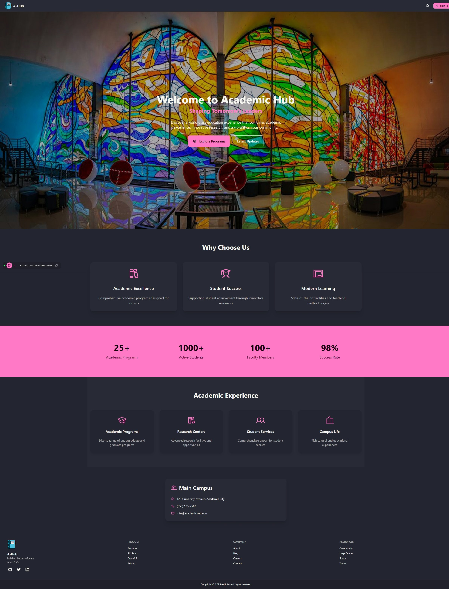
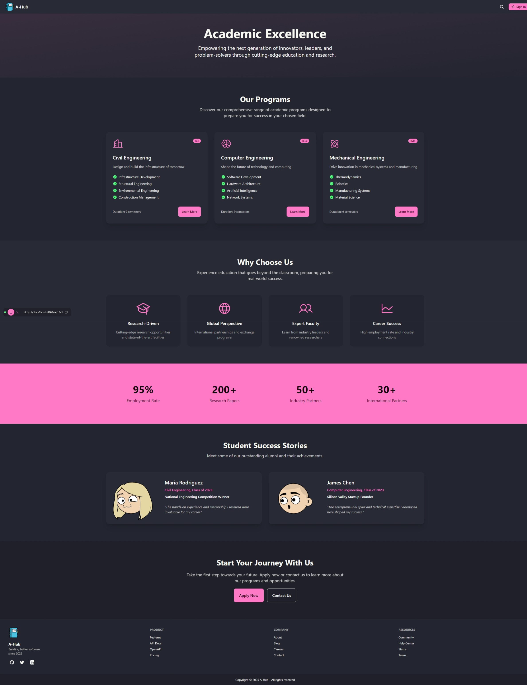
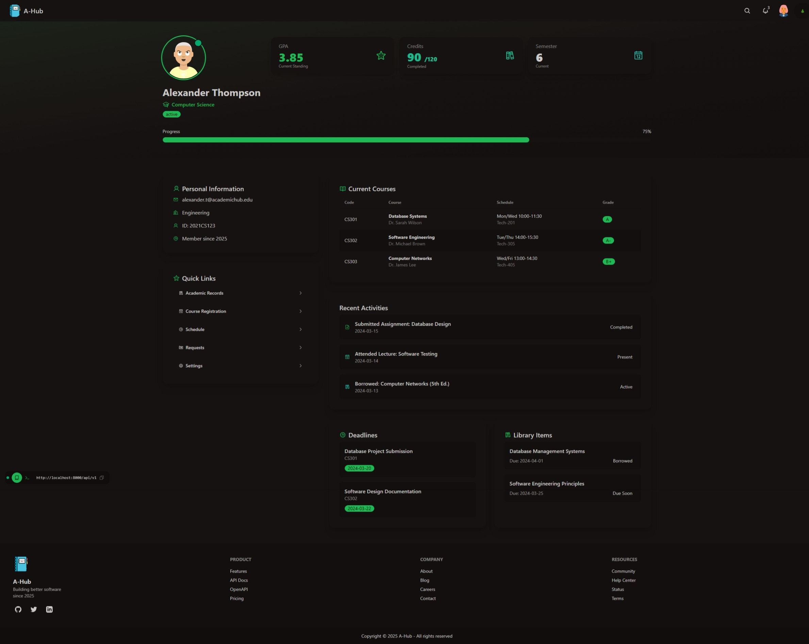
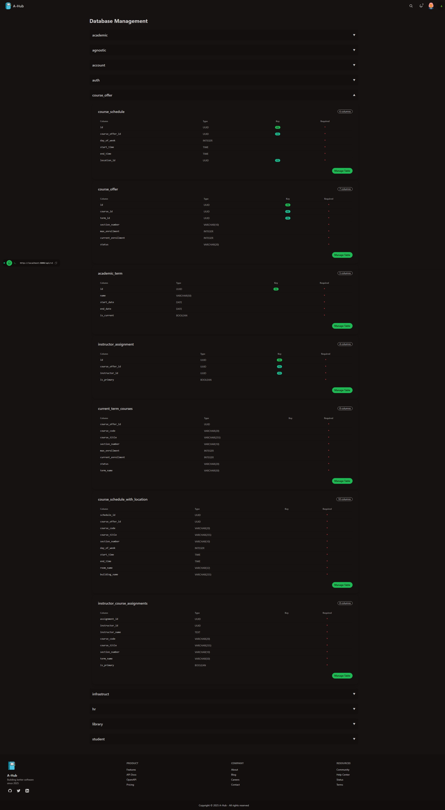

# Academic Hub Frontend

The frontend application for Academic Hub, built with SvelteKit and enhanced with DaisyUI for a modern, responsive user interface.

## Tech Stack

- [**SvelteKit**](https://kit.svelte.dev/) as the core frontend framework
- [**TailwindCSS**](https://tailwindcss.com/) for utility-first styling
- [**DaisyUI**](https://daisyui.com/) for rapid UI development
- [**TypeScript**](https://www.typescriptlang.org/) for type-safe development
- [**Vite**](https://vitejs.dev/) as the build tool and development server

## Project Structure

```bash
core/
├── src/
│   ├── lib/            # Shared components and utilities
│   ├── routes/         # Application routes/pages
│   ├── app.css         # Global styles
│   └── app.html        # HTML template
├── static/             # Static assets
├── package.json        # Project dependencies
├── svelte.config.js    # Svelte configuration
├── tailwind.config.ts  # Tailwind configuration
└── vite.config.ts      # Vite configuration
```

## Getting Started

```bash
# Install dependencies
npm install

# Start development server
npm run dev
```

# Showcasing the Academic Hub Frontend







## Features

- **Responsive Design**: Works seamlessly across devices
- **Theme Support**: Built-in theme system via DaisyUI
- **Type Safety**: Full TypeScript integration
- **Fast Development**: Hot module replacement (HMR)
- **Modern Tooling**: Latest web development tools and practices

## Development Workflow

- Components are created in `src/lib`
- Pages are added in `src/routes`
- Global styles go in `app.css`
- Static assets are placed in `static/`

## Available Scripts

- `npm run dev`: Start development server
- `npm run build`: Build for production
- `npm run preview`: Preview production build
- `npm run check`: TypeScript type checking
- `npm run check:watch`: Watch mode type checking
